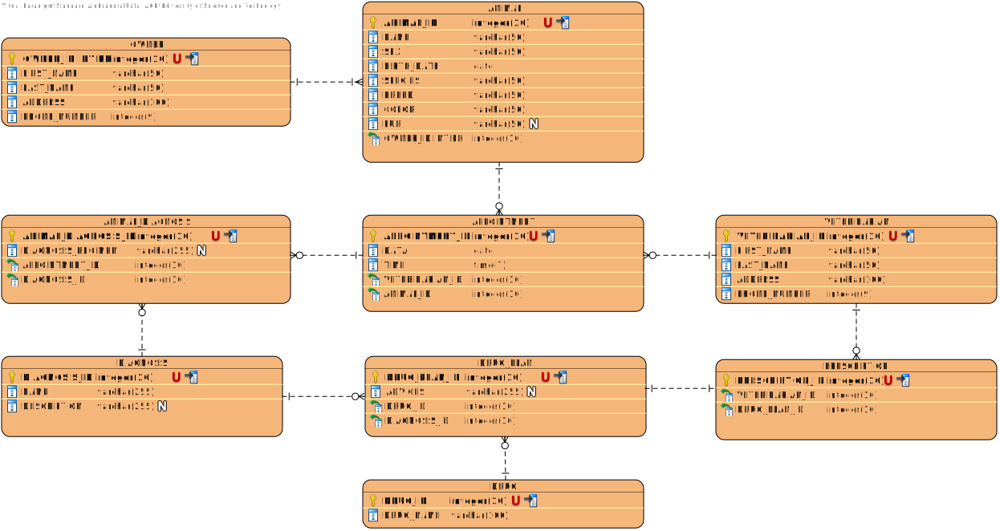

# Temat projektu
Tematem projektu jest zaproponowana przez nas "Klinika weterynaryjna".

| Nazwisko i imię | Wydział | Kierunek | Semestr | Grupa | Rok akademicki |
| :-------------: | :-----: | :------: | :-----: | :---: | :------------: |
| Rataj Aleksandra| WIMiIP  | IS       |   4     | 3     | 2019/2020      |
| Smerecki Jan    | WIMiIP  | IS       |   4     | 3     | 2019/2020      |

## Projekt bazy danych

Baza danych składa się z 9 tabel:
- owner,
- animal,
- appointment,
- animal_diagnosis,
- diagnosis,
- drug_plan,
- drug,
- veterinarian,
- prescription.

### Schemat bazy danych:


### Przykładowe zapytania z grupy DDL:

Utworzenie tabeli "animal":

```sql
CREATE TABLE `animal` (
  `animal_id` int(11) NOT NULL,
  `name` varchar(50) NOT NULL,
  `sex` varchar(50) NOT NULL,
  `birth_date` date NOT NULL,
  `species` varchar(50) NOT NULL,
  `breed` varchar(50) NOT NULL,
  `color` varchar(50) NOT NULL,
  `fur` varchar(50) DEFAULT NULL,
  `owner_id` int(11) NOT NULL
);
```

Utworzenie tabeli "appointment":

```sql
CREATE TABLE `appointment` (
  `appointment_id` int(11) NOT NULL,
  `data` date NOT NULL,
  `time` time NOT NULL,
  `veterinarian_id` int(11) NOT NULL,
  `animal_id` int(11) NOT NULL
);
```

Utworzenie tabeli "animal_diagnosis":

```sql
CREATE TABLE `animal_diagnosis` (
  `animal_diagnosis_id` int(11) NOT NULL,
  `regimen` varchar(255) DEFAULT NULL,
  `appointment_id` int(11) NOT NULL,
  `diagnosis_id` int(11) NOT NULL
);
```
Utworzenie tabeli "veterinarian":

```sql
CREATE TABLE `veterinarian` (
  `veterinarian_id` int(11) NOT NULL,
  `first_name` varchar(50) NOT NULL,
  `last_name` varchar(50) NOT NULL,
  `address` varchar(100) NOT NULL,
  `phone_number` int(9) NOT NULL
);
```
Modyfikacja tabeli "prescription" - dodanie kluczy:

```sql
ALTER TABLE `prescription`
  ADD PRIMARY KEY (`perscription_id`),
  ADD KEY `veterinarian_id` (`veterinarian_id`),
  ADD KEY `drug_plan_id` (`drug_plan_id`);
```

Modyfikacja tabeli "animal_diagnosis" - dodanie ograniczeń:

```sql
ALTER TABLE `animal_diagnosis`
  ADD CONSTRAINT `animal_diagnosis_ibfk_2` FOREIGN KEY (`diagnosis_id`) REFERENCES `diagnosis` (`diagnosis_id`),
  ADD CONSTRAINT `animal_diagnosis_ibfk_3` FOREIGN KEY (`appointment_id`) REFERENCES `appointment` (`appointment_id`);
```

Modyfikacja tabeli "appointment" - dodanie autoinkrementacji kolumn:

```sql
ALTER TABLE `appointment`
  MODIFY `appointment_id` int(11) NOT NULL AUTO_INCREMENT, AUTO_INCREMENT=25;
```


## Implementacja zapytań SQL

1) Wypisanie wszystkich właścicieli sortując alfabetycznie po nazwisku:
```sql
SELECT * FROM owner ORDER BY last_name ASC;
```

2) Dodanie nowego właściciela zwierzęcia do bazy danych:
```sql
INSERT INTO owner(first_name, last_name, address, phone_number) 
VALUES ('Krystyna', 'Kwiatek', 'ul Bratysławska 7a', 'Kraków 31-201', 124785693);
```

3) Usunięcie właściciela zwierzęcia z bazy danych:
```sql
DELETE FROM owner WHERE first_name = "Krystyna" AND last_name = "Kwiatek";
```

4) Wypisanie wszystkich zwierząt sortując alfabetycznie po imieniu:
```sql
SELECT * FROM animal ORDER BY name ASC;
```

5) Dodanie nowego zwierzęcia dla danego właściciela:
```sql
INSERT INTO animal(name, sex, birth_date, species, breed, color, fur, owner_id) 
VALUES ('Azor', 'Male', '2019-03-25', 'Pies', 'Owczarek Niemiecki', 'Brązowo-Czarny', 'Mieszane', 1);
```

6) Usunięcie danego zwierzęcia wybranego właściciela:
```sql
DELETE FROM animal WHERE name = "Azor" AND owner_id = 1;
```

7) Wypisanie wszystkich zwierząt właściciela, na podstawie imienia oraz nazwiska właściciela:
```sql
SELECT owner.first_name, owner.last_name, animal.name, animal.sex, animal.birth_date, animal.species 
FROM animal INNER JOIN owner ON animal.owner_id = owner.owner_id 
WHERE owner.first_name = 'Barbara' AND owner.last_name = 'Warszawska';
```

8) Wypisanie informacji szczegółowych o zwierzęciu właściciela, na podstawie imienia i nazwiska właściciela oraz i imienia zwierzęcia:
```sql
SELECT animal.* FROM animal 
INNER JOIN owner ON animal.owner_id = owner.owner_id 
WHERE owner.first_name = "Barbara" AND owner.last_name = "Warszawska" AND animal.name = 'Brutus';
```

9) Wypisanie wszystkich wizyt:
```sql
SELECT * FROM appointment;
```

10) Dodanie wizyty dla danego zwierzęcia:
```sql
INSERT INTO appointment(data, time, veterinarian_id, animal_id) VALUES ('2020-05-27', '15:00:00', 1, 1);
```

11) Edycja wizyty:
```sql
UPDATE appointment SET data = '2020-07-07', time = '10:00', animal_id = 4, veterinarian_id = 6 
WHERE data = '2020-05-27' AND time  = '15:00:00';
```

12) Wypisanie wszystkich wizyt dla danego właściciela, na podstawie imienia oraz nazwiska właściciela:
```sql
SELECT owner.first_name, owner.last_name, animal.name, appointment.data, appointment.time 
FROM animal JOIN appointment ON appointment.animal_id = animal.animal_id 
JOIN owner ON animal.owner_id = owner.owner_id 
WHERE owner.last_name = 'Warszawska';
```

13) Wypisanie diagnoz dla zwierzęcia:
```sql
SELECT animal.name, appointment.data, diagnosis.name, diagnosis.description 
FROM animal INNER JOIN appointment ON animal.animal_id = appointment.animal_id 
INNER JOIN animal_diagnosis ON animal.animal_id = animal_diagnosis.animal_diagnosis_id 
INNER JOIN diagnosis ON animal_diagnosis.animal_diagnosis_id = diagnosis.diagnosis_id 
WHERE animal.name = 'Burek';
```

14) Wypisanie wizyt na dany dzień dla weterynarza na podstawie imienia oraz nazwiska:
```sql
SELECT appointment.data, appointment.time, owner.first_name, owner.last_name, animal.name, 
animal.species, animal.breed, veterinarian.first_name, veterinarian.last_name 
FROM owner INNER JOIN animal ON owner.owner_id = animal.owner_id 
INNER JOIN appointment ON animal.animal_id = appointment.animal_id 
INNER JOIN veterinarian ON appointment.veterinarian_id = veterinarian.veterinarian_id 
WHERE veterinarian.first_name = 'Kordian' 
AND veterinarian.last_name = 'Kowalski' AND appointment.data = CURRENT_DATE;
```

15) Dodanie diagnozy do zwierzęcia przez weterynarza:
```sql
INSERT INTO animal_diagnosis(regimen, appointment_id, diagnosis_id) 
VALUES ('Zalecane ogarniczenie spacerów', 25, 16);
```

16) Dodanie leku do recepty:
```sql
INSERT INTO drug_plan(diagnosis_id, advices, drug_id) 
VALUES(16, 'Suplementacja: 5 razy w tygodniu', 5);
```

## Aplikacja

Aplikacja została zaimplementowana w języku Java. Baza danych została podpięta do aplikacji za pomocą klasy DriverManager, która jest podstawową usługą do zarządzania sterownikami JDBC.

```
 Connection conn;

 public boolean open() {
        try {
            conn = DriverManager.getConnection("jdbc:mysql://localhost/vet_clinic?useUnicode=true" +
                    "&useJDBCCompliantTimezoneShift=true&useLegacyDatetimeCode=false&serverTimezone=UTC");

            return true;
        } catch (SQLException e) {
            System.out.println("Couldn't open connection: " + e.getMessage());
            return false;
        }
    }
```

Utworzono klasy, które bezpośrednio nawiązują do odpowiednich tabel, poprzez nazwę i adekwatne pola. Wszystkie utworzne klasy, znajdują się w osobnej paczce o nazwie "model". Klasa Datasource łączy w sobie wszystkie funkcjonalności oraz zapytania SQL, potrzebne do poprawnego działania aplikacji.

Po uruchomieniu aplikacji można dokonać wyboru użytkownika. Dostępni użytkownicy to Właściciel, 
Weterynarz oraz Administrator. W celu zalogowania się jako Właściciel lub Weterynarz należy podać
imię, nazwisko oraz numer telefonu. W celu zalogowania się jako administrator należy podać sekretny
login i hasło. 

Poszczególni użytkownicy po zalogowaniu mogą wykonywać następujące czynności:

Właściciel:
- Wypisanie wszystkich zwierząt,
- Wypisanie informacji szczegółowych o zwierzęciu,
- Wypisanie wszystkich wizyt,
- Wypisanie diagnoz dla wybranego zwierzęcia.

Weterynarz:
- Wypisanie informacji szczegółowych o zwierzęciu,
- Wypisanie wizyt na dany dzień dla weterynarza,
- Dodanie diagnozy do zwierzęcia,
- Wypisanie diagnoz dla zwierzęcia,
- odanie leku do recepty.

Administrator:
- Wypisanie wszystkich właścicieli,
- Dodanie nowego właściciela zwierzęcia do bazy danych,
- Usunięcie właściciela zwierzęcia z bazy danych,
- Wypisanie wszystkich zwierząt,
- Dodanie nowego zwierzęcia dla danego właściciela,
- Usunięcie danego zwierzęcia wybranego właściciela,
- Wypisanie wszystkich wizyt,
- Dodanie wizyty,
- Edycja wizyty.

Przykładowa implementacja funkcjonalności:

1) Funkcjonalność właściciela - wypisanie wszystkich zwierząt.
Funkcja queryAnimalsByOwner przyjmuje argumenty: imię właściciela, nazwisko właściciela oraz rodzaj sortowania wyników (wybrana domyślna wartość 3 - ORDER BY DESC). Argumenty są wprowadzane z klawiatury przez użytkownika w pętli działań głównej funkcji main. Funkcja queryAnimalsByOwner dodaje wszystkie zwierzęta podanego właściciela do listy, którą potem zwraca. W funkcji main, dane właściciela takie, jak imię oraz nazwisko przypisywane są do zmiennych w momencie jego zalogowania. Dzięki temu, po wybraniu odpowiedniej opcji, wypisywane są wszystkie zwierzęta z listy właściciela. 

```
// klasa Datasource.java
    public List<Animal> queryAnimalsByOwner(String ownerFirstName, String ownerLastName, int sortOrder) {

        StringBuilder sb = new StringBuilder(QUERY_ANIMALS_BY_OWNER_START);
        sb.append(ownerFirstName);
        sb.append("\"");
        sb.append(" AND " + TABLE_OWNER + "." + COLUMN_OWNER_LAST_NAME + " = \"");
        sb.append(ownerLastName);
        sb.append("\"");

        if (sortOrder != ORDER_BY_NONE) {
            sb.append(QUERY_ANIMALS_BY_OWNER_SORT);
            if (sortOrder == ORDER_BY_DESC) {
                sb.append("DESC");
            } else {
                sb.append("ASC");
            }
        }

        try (Statement statement = conn.createStatement();
             ResultSet resultSet = statement.executeQuery(sb.toString())) {

            List<Animal> animals = new ArrayList<>();
            while (resultSet.next()) {

                Animal animal = new Animal();
                animal.setName(resultSet.getString(1));
                animal.setSex(resultSet.getString(2));
                animal.setBirth_date(resultSet.getDate(3));
                animal.setSpecies(resultSet.getString(4));

                animals.add(animal);
            }

            return animals;

        } catch (SQLException e) {
            System.out.println("Query failed: " + e.getMessage());
            return null;
        }
    }

// klasa main.java
List<Animal> ownerAnimals = datasource.queryAnimalsByOwner(ownerFirstName, ownerLastName, 3);

System.out.println("\nWypisanie wszystkich zwierząt właściciela: \n");

                    if (ownerAnimals == null) {
                        System.out.println("Nie udało się odnaleźć zwierząt dla właściciela: " + ownerFirstName + " " + ownerLastName);
                        return;
                    }

                    for (Animal animal : ownerAnimals) {
                        System.out.println(animal.getName() + "\t" + animal.getSex() + "\t" + animal.getBirth_date() + "\t" +
                                animal.getSpecies());
                    }
```

2) Funkcjonalność weterynarza - wypisanie informacji o wizytach w podanym dniu. 
Funckja queryAppointmentForVeterinarian przyjmuje takie argumenty, jak imię i nazwisko weterynarza oraz datę wizyt. Znalezione w bazie danych wizyty zapisywane są do listy, która jest potem zwracana. W głównej funkcji main, weterynarz podaje wybrany dzień, miesiąc oraz rok. Wypisane zostają wszystkie wizyty umówione na podaną datę lub zwracany jest odpowiedni komunikat o braku wizyt.

```
// klasa Datasource.java
    public List<AppointmentForVeterinarian> queryAppointmentForVeterinarian(String first_name,String last_name, Date date) {
        StringBuilder sb = new StringBuilder(QUERY_APPOINTMENT_FOR_VETERINARIAN);
        sb.append(first_name);
        sb.append("\" AND ");
        sb.append(TABLE_VETERINARIAN + "." + COLUMN_VETERINARIAN_LAST_NAME + " = \"");
        sb.append(last_name);
        sb.append("\" AND ");
        sb.append(TABLE_APPOINTMENT + "." + COLUMN_APPOINTMENT_DATA + " = \"");
        sb.append(date);
        sb.append("\"");

        try (Statement statement = conn.createStatement();
             ResultSet resultSet = statement.executeQuery(sb.toString())) {

            List<AppointmentForVeterinarian> appointmentForVeterinarians = new ArrayList<>();
            while (resultSet.next()) {

                AppointmentForVeterinarian appointmentForVeterinarian = new AppointmentForVeterinarian();
                appointmentForVeterinarian.setDate(resultSet.getDate(1));
                appointmentForVeterinarian.setTime(resultSet.getTime(2));
                appointmentForVeterinarian.setOwner_first_name(resultSet.getString(3));
                appointmentForVeterinarian.setOwner_last_name(resultSet.getString(4));
                appointmentForVeterinarian.setAnimal_name(resultSet.getString(5));
                appointmentForVeterinarian.setAnimal_species(resultSet.getString(6));
                appointmentForVeterinarian.setAnimal_breed(resultSet.getString(7));
                appointmentForVeterinarian.setVeterinarian_first_name(resultSet.getString(8));
                appointmentForVeterinarian.setVeterinarian_last_name(resultSet.getString(9));

                appointmentForVeterinarians.add(appointmentForVeterinarian);
            }

            return appointmentForVeterinarians;

        } catch (SQLException e) {
            System.out.println("Query failed: " + e.getMessage());
            return null;
        }
    }

// klasa main.java
                    System.out.println("\nWypisanie wizyt na dany dzień dla weterynarza: \n");

                    Date date;

                    try {
                        System.out.println("Podaj datę: ");
                        System.out.print("Dzień: ");
                        int day = scan.nextInt();
                        System.out.print("Miesiac: ");
                        int month = scan.nextInt();
                        System.out.print("Rok: ");
                        int year = scan.nextInt();
                        date = new Date(year - 1900, month - 1, day);
                    } catch (InputMismatchException e) {
                        System.out.println("\nPodano nieprawidłowe dane!");
                        break;
                    }

                    System.out.println("Wizyty w dniu " + date + ":");
                    List<AppointmentForVeterinarian> appointmentForVeterinarians =
                            datasource.queryAppointmentForVeterinarian(vetFirstName, vetLastName, date);
                    for (AppointmentForVeterinarian appointmentForVeterinarian : appointmentForVeterinarians) {
                        System.out.println(appointmentForVeterinarian.toString());
                    }

                    if (appointmentForVeterinarians.isEmpty()) {
                        System.out.println("Brak wizyt!");
                    }
```


3) Funkcjonalność administratora - dodanie nowego zwierzęcia dla danego właściciela.
Funkcja insertAnimal, jako argumenty przyjmuje wszystkie atrybuty z klasy Animal.java tak, aby obiekt mogł zostać poprawnie utworzony. Funkcja sprawdza, czy istnieje właściciel, do którego ma zostać przypisane nowe zwierzę. Zwracane są odpowiednie komunikaty w zależności od zawartości zmiennej isOwner. W funkcji main następuje podanie wszystkich argumentów przez administatora z klawiatury.


```
// klasa Datasource.java
    public void insertAnimal(String name, String sex, Date birthDate, String species, String breed, String color,
                             String fur, int ownerId) {
        try {
            List<Owner> owners = this.queryOwner(1);
            boolean isOwner = false;

            for (Owner owner : owners) {
                if (owner.getOwner_id() == ownerId) {
                    isOwner = true;
                    break;
                }
            }

            if (isOwner) {
                insertIntoAnimal.setString(1, name);
                insertIntoAnimal.setString(2, sex);
                insertIntoAnimal.setDate(3, birthDate);
                insertIntoAnimal.setString(4, species);
                insertIntoAnimal.setString(5, breed);
                insertIntoAnimal.setString(6, color);
                insertIntoAnimal.setString(7, fur);
                insertIntoAnimal.setInt(8, ownerId);

                insertIntoAnimal.executeUpdate();
                System.out.println("\nDodanie przebiegło pomyślnie!\n");
            } else {
                System.out.println("Nie udało znaleźć się właściciela o takim ID: " + ownerId);
            }
        } catch (SQLException e) {
            System.out.println(e.getMessage());
            System.out.println("\nNie udało się dodać zwierzęcia!\n");
        }
    }

// klasa main.java
                    System.out.println("\nDodanie nowego zwierzęcia dla danego właściciela:\n");
                    try {
                        System.out.print("Podaj imie: ");
                        String name = scan.next();
                        System.out.print("Podaj płeć: ");
                        String sex = scan.next();
                        System.out.println("Podaj date urodzenia: ");
                        System.out.print("Dzień: ");
                        int day = scan.nextInt();
                        System.out.print("Miesiac: ");
                        int month = scan.nextInt();
                        System.out.print("Rok: ");
                        int year = scan.nextInt();
                        Date date = new Date(year - 1900, month - 1, day);
                        System.out.print("Podaj gatunek: ");
                        String species = scan.next();
                        System.out.print("Podaj rasę: ");
                        String breed = scan.next();
                        System.out.print("Podaj kolor: ");
                        String color = scan.next();
                        System.out.print("Podaj rodzaj sierści: ");
                        String fur = scan.next();
                        System.out.print("Podaj id właściciela: ");
                        int ownerId = scan.nextInt();
                        scan.nextLine();

                        datasource.insertAnimal(name, sex, date, species, breed, color, fur, ownerId);
                        break;
                    } catch (InputMismatchException e) {
                        System.out.println("\nPodano nieprawidłowe dane!");
                        break;
                    }
```
