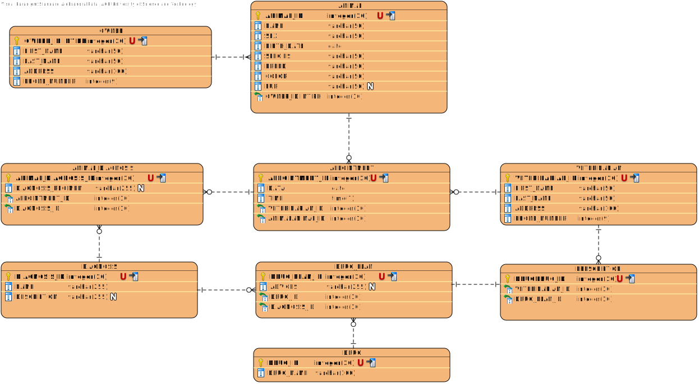

# Temat projektu
Tematem projektu jest zaproponowana przez nas "Klinika weterynaryjna".

| Nazwisko i imię | Wydział | Kierunek | Semestr | Grupa | Rok akademicki |
| :-------------: | :-----: | :------: | :-----: | :---: | :------------: |
| Rataj Aleksandra| WIMiIP  | IS       |   4     | 3     | 2019/2020      |
| Smerecki Jan    | WIMiIP  | IS       |   4     | 3     | 2019/2020      |

## Projekt bazy danych
Schemat bazy danych:


### Przykładowe zapytania z grupy DDL
```sql
CREATE TABLE `animal` (
  `animal_id` int(11) NOT NULL,
  `name` varchar(50) NOT NULL,
  `sex` varchar(50) NOT NULL,
  `birth_date` date NOT NULL,
  `species` varchar(50) NOT NULL,
  `breed` varchar(50) NOT NULL,
  `color` varchar(50) NOT NULL,
  `fur` varchar(50) DEFAULT NULL,
  `owner_id` int(11) NOT NULL
);

CREATE TABLE `appointment` (
  `appointment_id` int(11) NOT NULL,
  `data` date NOT NULL,
  `time` time NOT NULL,
  `veterinarian_id` int(11) NOT NULL,
  `animal_id` int(11) NOT NULL
);

CREATE TABLE `animal_diagnosis` (
  `animal_diagnosis_id` int(11) NOT NULL,
  `regimen` varchar(255) DEFAULT NULL,
  `appointment_id` int(11) NOT NULL,
  `diagnosis_id` int(11) NOT NULL
);

CREATE TABLE `veterinarian` (
  `veterinarian_id` int(11) NOT NULL,
  `first_name` varchar(50) NOT NULL,
  `last_name` varchar(50) NOT NULL,
  `address` varchar(100) NOT NULL,
  `phone_number` int(9) NOT NULL
);
```

## Implementacja zapytań SQL

1) Dodanie nowego właściciela zwierzęcia do bazy danych:
```sql
INSERT INTO owner(first_name, last_name, address, phone_number) 
VALUES ('Krystyna', 'Kwiatek', 'ul Bratysławska 7a', 'Kraków 31-201', 124785693);
```

2) Usunięcie właściciela zwierzęcia z bazy danych:
```sql
DELETE FROM owner WHERE first_name = "Krystyna" AND last_name = "Kwiatek";
```

3) Dodanie nowego zwierzęcia dla danego właściciela:
```sql
INSERT INTO animal(name, sex, birth_date, species, breed, color, fur, owner_id) 
VALUES ('Azor', 'Male', '2019-03-25', 'Pies', 'Owczarek Niemiecki', 'Brązowo-Czarny', 'Mieszane', 1);
```

4) Usunięcie danego zwierzęcia wybranego właściciela:
```sql
DELETE FROM animal WHERE name = "Azor" AND owner_id = 1;
```

5) Wypisanie wszystkich zwierząt właściciela, na podstawie imienia oraz nazwiska właściciela:
```sql
SELECT owner.first_name, owner.last_name, animal.name, animal.sex, animal.birth_date, animal.species 
FROM animal INNER JOIN owner ON animal.owner_id = owner.owner_id 
WHERE owner.first_name = 'Barbara' AND owner.last_name = 'Warszawska';
```

6) Wypisanie informacji szczegółowych o zwierzęciu właściciela, na podstawie imienia i nazwiska właściciela oraz i imienia zwierzęcia:
```sql
SELECT animal.* FROM animal 
INNER JOIN owner ON animal.owner_id = owner.owner_id 
WHERE owner.first_name = "Barbara" AND owner.last_name = "Warszawska" AND animal.name = 'Brutus';
```

7) odanie wizyty dla danego zwierzęcia:
```sql
INSERT INTO appointment(data, time, veterinarian_id, animal_id) VALUES ('2020-05-27', '15:00:00', 1, 1);
```

8) Edycja wizyty:
```sql
UPDATE appointment SET data = '2020-07-07', time = '10:00', animal_id = 4, veterinarian_id = 6 
WHERE data = '2020-05-27' AND time  = '15:00:00';
```

9) Wypisanie wszystkich wizyt dla danego właściciela, na podstawie imienia oraz nazwiska właściciela:
```sql
SELECT owner.first_name, owner.last_name, animal.name, appointment.data, appointment.time 
FROM animal JOIN appointment ON appointment.animal_id = animal.animal_id 
JOIN owner ON animal.owner_id = owner.owner_id 
WHERE owner.last_name = 'Warszawska';
```

10) Wypisanie diagnoz dla zwierzęcia:
```sql
SELECT animal.name, appointment.data, diagnosis.name, diagnosis.description 
FROM animal INNER JOIN appointment ON animal.animal_id = appointment.animal_id 
INNER JOIN animal_diagnosis ON animal.animal_id = animal_diagnosis.animal_diagnosis_id 
INNER JOIN diagnosis ON animal_diagnosis.animal_diagnosis_id = diagnosis.diagnosis_id 
WHERE animal.name = 'Burek';
```

11) Wypisanie wizyt na dany dzień dla weterynarza na podstawie imienia oraz nazwiska:
```sql
SELECT appointment.data, appointment.time, owner.first_name, owner.last_name, animal.name, 
animal.species, animal.breed, veterinarian.first_name, veterinarian.last_name 
FROM owner INNER JOIN animal ON owner.owner_id = animal.owner_id 
INNER JOIN appointment ON animal.animal_id = appointment.animal_id 
INNER JOIN veterinarian ON appointment.veterinarian_id = veterinarian.veterinarian_id 
WHERE veterinarian.first_name = 'Kordian' 
AND veterinarian.last_name = 'Kowalski' AND appointment.data = CURRENT_DATE;
```

12) Dodanie diagnozy do zwierzęcia przez weterynarza:
```sql
INSERT INTO animal_diagnosis(regimen, appointment_id, diagnosis_id) 
VALUES ('Zalecane ogarniczenie spacerów', 25, 16);
```

13) Dodanie leku do recepty:
```sql
INSERT INTO drug_plan(diagnosis_id, advices, drug_id) 
VALUES(16, 'Suplementacja: 5 razy w tygodniu', 5);
```

## Aplikacja
Tutaj należy opisać aplikację, która wykorzystuje zapytania SQL z poprzedniego kroku. Można, jednak nie jest to konieczne, wrzucić tutaj istotne snippety z Waszych aplikacji.

## Dodatkowe uwagi
W tej sekcji możecie zawrzeć informacje, których nie jesteście w stanie przypisać do pozostałych. Mogą to być również jakieś komentarze, wolne uwagi, itp.
